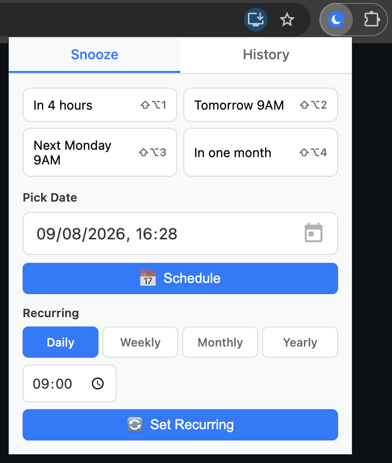

# Snooze Tabby — Snooze Tabs in Chrome and Get Them Back When You Need Them

Snooze Tabby is a free Chrome extension that closes a tab now and automatically reopens it exactly when you need it — in 4 hours, tomorrow morning, next Monday, or on any custom or recurring schedule. Declutter your browser without losing anything: snoozed tabs come back reliably, even after you close the browser or shut down your computer.

## Features

- **One-click snooze** — In 4 hours · Tomorrow 9AM · Next Monday 9AM · In one month
- **Custom date & time** — pick any moment with the date picker
- **Recurring tabs** — reopen a tab daily, weekly, monthly, or yearly (e.g. your timesheet every Friday at 9:00)
- **Never lose a tab** — schedules survive browser restarts and shutdowns; anything missed reopens on next launch
- **History** — see all snoozed tabs, cancel any schedule, export/import backups
- **Keyboard shortcuts** — snooze the current tab without opening the popup

## Installation

1. Download or clone this repository
2. Open `chrome://extensions/` in Chrome
3. Turn on **Developer mode** (top right)
4. Click **Load unpacked** and select the extension folder
5. Pin Snooze Tabby to your toolbar — done

Works in Google Chrome, Microsoft Edge, and other Chromium-based browsers (Manifest V3).

## How to snooze a tab

1. Click the Snooze Tabby icon in the toolbar
2. Pick a quick option, choose a custom date, or set a recurring schedule
3. The tab closes and reopens automatically at the scheduled time

Manage or cancel snoozed tabs anytime from the **History** tab in the popup.

## Keyboard shortcuts

| Snooze until       | Mac           | Windows / Linux |
| ------------------ | ------------- | --------------- |
| In 4 hours         | `Shift+Alt+1` | `Shift+Ctrl+1`  |
| Tomorrow 9AM       | `Shift+Alt+2` | `Shift+Ctrl+2`  |
| Next Monday 9AM    | `Shift+Alt+3` | `Shift+Ctrl+3`  |
| In one month       | `Shift+Alt+4` | `Shift+Ctrl+4`  |

## Privacy

Everything stays on your device. Snoozed tab URLs are stored locally in your browser — no account, no servers, no tracking.

---

Inspired by [this tweet](https://x.com/ksaitor/status/1944997383441731953). Contributions welcome — open an issue or pull request.
